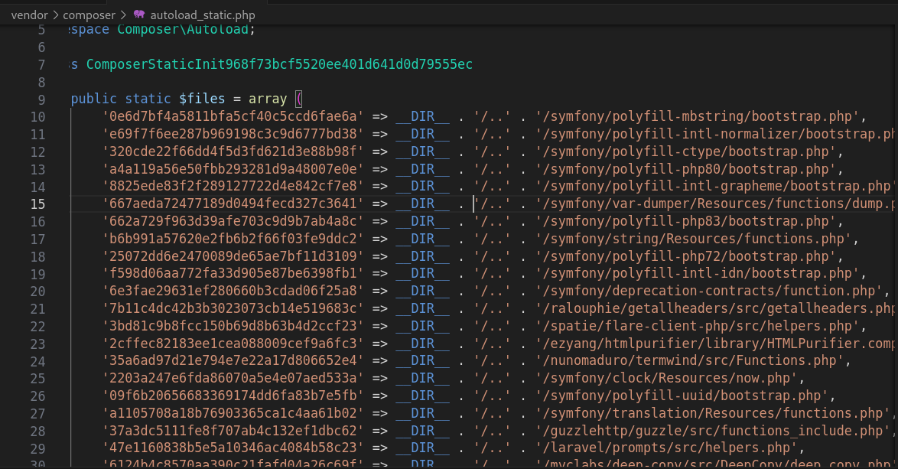

<div align="center">
  <p align="center"><a href="https://laravel.com" target="_blank"></a></p>
  <h1>🚀  Web-Artisan Engineering  🤵‍♂   </h1>
  <h3> /vendor/composer/autoload_real.php 📁</h3>
  
  <p>
    
  </p>
</div>


## What's this file?
The `/vendor/composer/autoload_real.php` file is commonly  playing a crucial role in managing the autoloading of classes and resources within a Laravel application.

Laravel utilizes Composer as its dependency manager. When you install Laravel or add dependencies to your Laravel project using Composer, Composer generates the autoloader files, including `autoload_real.php`.

Let's us don't waste time le's go:
### Line 1-7
```
<?php

// autoload_real.php @generated by Composer
class ComposerAutoloaderInit968f73bcf5520ee401d641d0d79555ec
{
    private static $loader;
```
This class serves as an initializer for Composer's autoloader, Inside the class, there's a private static property `$loader`.

The `$loader` property within the class is static and private, meaning it belongs to the class itself and cannot be accessed from outside the class. This property holds an instance of Composer's autoloader. Making it static allows it to be shared across different instances of the class, ensuring there's only one instance of the autoloader throughout the application.

### Line 8-14
```
     
public static function loadClassLoader($class)
{
    if ('Composer\Autoload\ClassLoader' === $class) {
        require __DIR__ . '/ClassLoader.php';
    }
}
```
The `loadClassLoader` method is responsible for loading Composer's autoloader class ([ClassLoader.php](ClassLoader.md) which is in the same directory `/vendor/composer/` with [autoload_real.php](/vendor/composer/autoload_real.md)) into memory when it's required. It serves as a callback function for the spl_autoload_register function(*we will see later when it called*), which registers this method as an autoloader.

### Line 15-49
```
     
/**
    * @return \Composer\Autoload\ClassLoader
    */
public static function getLoader()
{
    if (null !== self::$loader) {
        return self::$loader;
    }
```
The if statement checks if the static property `$loader` is not null. If `$loader` is already set, meaning it contains an instance of Composer's autoloader, the method returns that existing loader instance immediately.

wow and I found that This approach is sometimes referred to as "Yoda conditions" in programming, where the constant or literal value is placed on the left side of the comparison operator. It's primarily used to prevent accidental assignment in conditional statements.

```
require __DIR__ . '/platform_check.php';
```
[platform_check.php](platform_check.md) is required here to ensure that the PHP environment meets the necessary requirements for Composer dependencies, helping to prevent compatibility issues and ensuring smooth operation of the application.

```
spl_autoload_register(array('ComposerAutoloaderInit968f73bcf5520ee401d641d0d79555ec', 'loadClassLoader'), true, true);
self::$loader = $loader = new \Composer\Autoload\ClassLoader(\dirname(__DIR__));
spl_autoload_unregister(array('ComposerAutoloaderInit968f73bcf5520ee401d641d0d79555ec', 'loadClassLoader'));
```

This block of code is responsible for registering and unregistering Composer's autoloader class (ClassLoader) within the PHP autoloading system.
The first line registers a callback function, loadClassLoader *(recursion)*, as an autoloader using spl_autoload_register. This function will be called *(call itself)* whenever a class is not found, allowing Composer to load the class dynamically. The second argument `true` specifies that the autoloader function `loadClassLoader` should be prepended to the autoload queue, ensuring that it's executed before other registered autoloaders. The third argument `true` specifies that the autoloader function should be registered in such a way that it can be unregistered later.

It creates an instance of `Composer\Autoload\ClassLoader` and assigns it to `self::$loader`.
This instance is initialized with the parent directory of the current script `(\dirname(__DIR__))`.

spl_autoload_unregister removes the previously registered loadClassLoader autoloader.
This prevents redundant calls to the autoloader after it has served its purpose.

Inshort,The code sets up Composer's autoloader by registering a class loader function, instantiating the class loader, and then unregistering the initial class loader function.

```
require __DIR__ . '/autoload_static.php';
```

The purpose of the `autoload_static.php` file is to contain static class mappings and other autoload configurations needed for Composer's autoloader.

- This file typically includes mappings between class names and their corresponding file paths. These mappings tell Composer's autoloader where to find the files containing the definitions for each class. By defining these mappings statically, Composer's autoloader can efficiently locate and load class files when they are needed, without the need for manual require or include statements.

- Storing class mappings statically in a dedicated file allows Composer to optimize the autoloading process. Instead of dynamically generating these mappings on each autoload request, Composer can load them from the static file, improving performance and reducing overhead. This optimization is particularly useful in production environments where efficiency and performance are crucial.

- Besides class mappings, autoload_static.php may also contain other autoload configurations or directives specified by Composer or package maintainers. These configurations could include additional class-loading rules, namespace mappings, or any other settings relevant to the autoloading process.

Overall, `autoload_static.php` serves as a central repository for static autoload configurations and mappings, facilitating efficient and optimized class loading within Composer-managed projects.



```
call_user_func(\Composer\Autoload\ComposerStaticInit968f73bcf5520ee401d641d0d79555ec::getInitializer($loader));
```
Composer's static classes, defined within the `ComposerStaticInit968f73bcf5520ee401d641d0d79555ec` class, require initialization before they can be used. The getInitializer method retrieves an initializer function that is responsible for initializing these static classes.

Instead of hard-coding the initialization logic directly into the code, Composer dynamically generates the initialization function based on the current autoloader instance ($loader).
This allows Composer to adapt the initialization process based on the specific environment and autoload configuration.

call_user_func is a PHP function that invokes a callback function. In this case, it invokes the initializer function obtained from `ComposerStaticInit968f73bcf5520ee401d641d0d79555ec::getInitializer($loader)`. Initializing Composer's static classes ensures that they are properly configured and ready for use in the autoloading process. This initialization step is crucial for ensuring that static class mappings and other autoload configurations are set up correctly.
In summary, call_user_func`\Composer\Autoload\ComposerStaticInit968f73bcf5520ee401d641d0d79555ec::getInitializer($loader)` dynamically invokes the initializer function to initialize Composer's static classes, preparing them for use in the autoloading process.

```
$loader->register(true);
```

`$loader->register(true)` calls the register method of the autoloader instance $loader. This method registers the autoloader with PHP's autoloading system, enabling it to dynamically load classes when they are referenced but not yet loaded.

The true parameter passed to the register method indicates that the autoloader should be prepended to the autoload queue. Prepending the autoloader ensures that it takes precedence over any other registered autoloaders, allowing it to handle class loading requests before other autoloaders.

By registering Composer's autoloader, PHP knows to delegate class loading requests to Composer's autoloader instance. This enables Composer to efficiently locate and load class files based on the predefined class mappings and autoload configurations.

Registering the autoloader optimizes the class loading process, reducing the need for manual require or include statements. This optimization improves the performance of the application, especially in scenarios where many classes are loaded dynamically.

In summary, `$loader->register(true)` registers Composer's autoloader instance with PHP's autoloading system, ensuring efficient and automated class loading within the application.

```
$filesToLoad = \Composer\Autoload\ComposerStaticInit968f73bcf5520ee401d641d0d79555ec::$files;
$requireFile = \Closure::bind(static function ($fileIdentifier, $file) {
    if (empty($GLOBALS['__composer_autoload_files'][$fileIdentifier])) {
        $GLOBALS['__composer_autoload_files'][$fileIdentifier] = true;

        require $file;
    }
}, null, null);
```

`$filesToLoad = \Composer\Autoload\ComposerStaticInit968f73bcf5520ee401d641d0d79555ec::$files;` retrieves an array of file paths from Composer's static initialization class. These are the files that need to be loaded to set up the autoloading environment.

`$requireFile = \Closure::bind(static function ($fileIdentifier, $file) { ... }, null, null); ` defines a closure (anonymous function) responsible for loading individual files. This closure is bound to the current context but with no specific object instance (hence null parameters). It's encapsulated to ensure proper file loading and management.

Within the closure, there's a conditional check to determine if the file identified by `$fileIdentifier` has already been loaded.
If the file hasn't been loaded `(empty($GLOBALS['__composer_autoload_files'][$fileIdentifier]))`, it's required (require $file) to load its contents. Once loaded, the file identifier is stored in a global array to track loaded files, preventing duplicate includes.

In short, `$filesToLoad` contains an array of file paths required for autoloading, while $requireFile defines a closure to load these files. This mechanism ensures that all necessary files are loaded efficiently and only once to set up Composer's autoloader correctly.

```
foreach ($filesToLoad as $fileIdentifier => $file) {
    $requireFile($fileIdentifier, $file);
}
```
foreach `($filesToLoad as $fileIdentifier => $file) { ... }` iterates over each entry in the `$filesToLoad` array. `$fileIdentifier` represents the identifier or key associated with each file, and $file represents the path to the file.

Within the loop, `$requireFile($fileIdentifier, $file);` calls the closure $requireFile to load each file identified by $file. The closure contains logic to ensure that each file is loaded only once and that its contents are available for autoloading.

Inside the closure, there's logic to check if the file identified by $fileIdentifier has already been loaded. If the file hasn't been loaded, it's required (require $file) to load its contents.
Once loaded, the file identifier is stored in a global array to track loaded files, preventing duplicate includes.

In brief, the foreach loop ensures that each file required for autoloading is loaded using the closure $requireFile. This mechanism ensures that all necessary files are loaded efficiently and only once to set up Composer's autoloader correctly.

```
        return $loader;
    }
}
```
This statement signifies the end of the method or function in which it appears.
Any code following this statement within the method will not be executed.

return $loader; returns the autoloader instance `$loader` to the caller.
The autoloader instance contains all the necessary configurations and mappings for class autoloading within the application.

By returning the autoloader instance, the method allows the caller to access and use the autoloader for class loading purposes.
This is particularly useful in scenarios where the autoloader needs to be used outside the current context, such as in other parts of the application.

In summary, `return $loader;` concludes the method by returning the autoloader instance to the caller, providing access to Composer's autoloader for class loading within the application.


<h1 align="center" style="margin-top: 40px;margin-bottom:40px;font-weight:700;"> Jump to Your Interest 🚀</h1>

Feel free to explore my the whole [roadmap](/non-laravel/roadmap.md).

## License
[MIT](LICENSE)